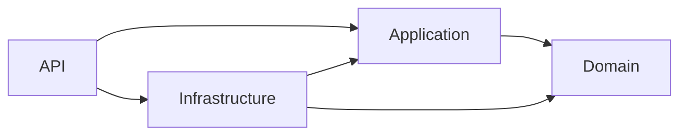

# Architecture Dependency Rules

## Purpose

MarketplaceAnalytics follows Clean Architecture. Dependencies point inward so that
business concepts and application behavior remain independent from frameworks and
delivery mechanisms.

### Domain

The Domain layer contains the core business model and business rules. It is the
innermost layer and must remain independent of every other solution layer.

### Application

The Application layer coordinates use cases and application-level contracts. It
may use the Domain layer, but it must not know about infrastructure or the API.

### Infrastructure

The Infrastructure layer provides implementations for technical concerns defined
by inner layers. It may depend on Domain and Application, but it must not depend on
the API.

### API

The API layer is the delivery and composition boundary for HTTP. It may depend on
Application and Infrastructure to compose and expose the application.

## Dependency rules

| Layer | Allowed dependencies | Forbidden dependencies |
| --- | --- | --- |
| Domain | None | Application, Infrastructure, API |
| Application | Domain | Infrastructure, API |
| Infrastructure | Domain, Application | API |
| API | Application, Infrastructure | Domain directly; dependencies should flow through Application and Infrastructure |

## Dependency direction

Arrows represent allowed compile-time dependency direction. No dependency may
point from an inner layer toward an outer layer.

## Architecture-test protection

`MarketplaceAnalytics.ArchitectureTests` references every production project so
their compiled assemblies are available to the test runner. The tests load the
actual output assemblies and use NetArchTest rules to inspect type dependencies.
Each forbidden dependency direction has a separately named test.

These tests run with the normal solution test suite. A future code change that
introduces a forbidden layer dependency causes the corresponding architecture
test to fail, preventing the violation from silently becoming part of the
solution.
